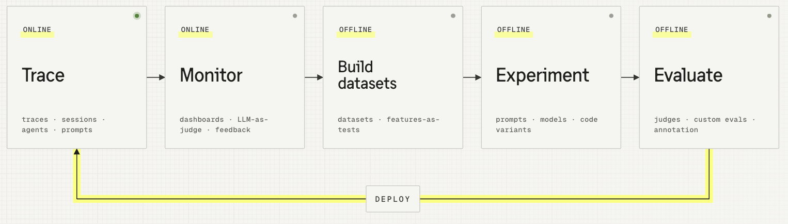

# Langfuse Workshop - the AI engineering loop, end to end

This is a step-by-step Langfuse workshop built on a small TypeScript sample application: the **Dad IT Support Agent**. The workshop covers the full AI engineering loop with Langfuse: tracing, prompt management, monitoring, datasets, experiments, and evaluation.

You can complete the workshop on your own from the learner lessons, or use the instructor notes to teach the same material to a group.

## For learners

Start with the learner lessons in [`docs/learner/`](./docs/learner/). Each lesson tells you which checkpoint to check out, what to change in code or configure in Langfuse, and how to verify the result.

Use the learner path if you want to:

- Log your first trace from a real LLM app and understand what you are looking at.
- Move a prompt into Langfuse so changes are versioned and linked to traces.
- Monitor production behavior without reading every trace by hand.
- Build a dataset, run experiments, and evaluate changes with evidence.
- Inspect a complete TypeScript reference implementation you can copy patterns from.

No instructor is required. The learner lessons are complete enough to run the workshop in self-guided mode.

## For instructors

The instructor guide is for people who want to teach Langfuse to others. Use the notes in [`docs/instructor/`](./docs/instructor/) alongside the learner lessons when you are facilitating a live workshop, recording a walkthrough, or adapting the material for a team.

The workshop does not depend on an instructor. The instructor notes add teaching points, demo rhythm, setup reminders, and common pitfalls; they are not required for someone completing the workshop alone.

## Workshop scope

The sample app is a small web chat where Dad opens the chat to get iPhone help. The agent is named **Specs** and answers with step-by-step instructions. Under the hood, it is a normal OpenAI tool-calling loop with two local tools.

`main` contains the complete reference app and current workshop docs. Use it to inspect the finished implementation or compare your work against the end state. The exercises themselves start from checkpoint tags.

## Modules

| Step | Learner lesson | Instructor notes | Checkpoint | What you will learn |
| --- | --- | --- | --- | --- |
| 00 | [Setup](./docs/learner/00-setup.md) | [Instructor notes](./docs/instructor/00-setup.md) | `checkpoint/00-setup` | Keys, install, run the app. |
| 01 | [Base App](./docs/learner/01-base-app.md) | [Instructor notes](./docs/instructor/01-base-app.md) | `checkpoint/01-base-app` | Tour the running app. Nothing to build. |
| 02 | [Tracing](./docs/learner/02-tracing.md) | [Instructor notes](./docs/instructor/02-tracing.md) | `checkpoint/02-tracing` | Log every agent step: generations, agent root, tool spans. |
| 03 | [Prompt Management](./docs/learner/03-prompt-management.md) | [Instructor notes](./docs/instructor/03-prompt-management.md) | `checkpoint/03-prompt-management` | Move the system prompt into Langfuse. |
| 04 | [Monitoring](./docs/learner/04-monitoring.md) | [Instructor notes](./docs/instructor/04-monitoring.md) | `checkpoint/04-monitoring` | Catch out-of-scope requests and user disagreement. |
| 05 | [Dataset](./docs/learner/05-dataset.md) | [Instructor notes](./docs/instructor/05-dataset.md) | `checkpoint/05-dataset` | Turn product scope into reusable examples. |
| 06 | [Experiments](./docs/learner/06-experiments.md) | [Instructor notes](./docs/instructor/06-experiments.md) | `checkpoint/06-experiments` | Run the agent against the dataset and score every item. |
| 07 | [Evaluation](./docs/learner/07-evaluation.md) | [Instructor notes](./docs/instructor/07-evaluation.md) | `checkpoint/07-evaluation` | Change one thing, rerun the dataset, compare runs. |
| 08 | [Wrap-up](./docs/learner/08-wrap-up.md) | [Instructor notes](./docs/instructor/08-wrap-up.md) | `checkpoint/08-wrap-up` | Apply the loop to your own app. |

## How to work through it

`main` is the complete reference implementation. For hands-on work, check out the checkpoint named in the lesson you are starting, make the missing changes, and verify the result before moving on.

`checkpoint/00-setup` and `checkpoint/01-base-app` intentionally contain the same untraced base app. Setup uses that state to validate keys, dependencies, and ports; Base App uses it for orientation. Tracing starts in `02-tracing`.

The workshop is small enough to finish in a sitting, and every module can also be used independently if you only care about one part of the loop.

## Repository layout

- [`docs/learner/`](./docs/learner/) contains the self-guided workshop lessons.
- [`docs/instructor/`](./docs/instructor/) contains facilitator notes for teaching the same lessons.
- [`docs/images/`](./docs/images/) contains screenshots and diagrams, grouped by lesson.
- [`src/`](./src/) contains the sample app.
- [`scripts/`](./scripts/) contains dataset and prompt helper scripts used in later lessons.

## Where to go next

- Walk the modules in order starting from [`docs/learner/00-setup.md`](./docs/learner/00-setup.md).
- Jump to whichever chapter matches what you want to learn.
- Install the [Langfuse skill](https://github.com/langfuse/skills) (`/langfuse`) to apply the patterns from this workshop to your own codebase.
- For bigger-picture material on each chapter, use the [Langfuse Academy](https://langfuse.com/academy).
