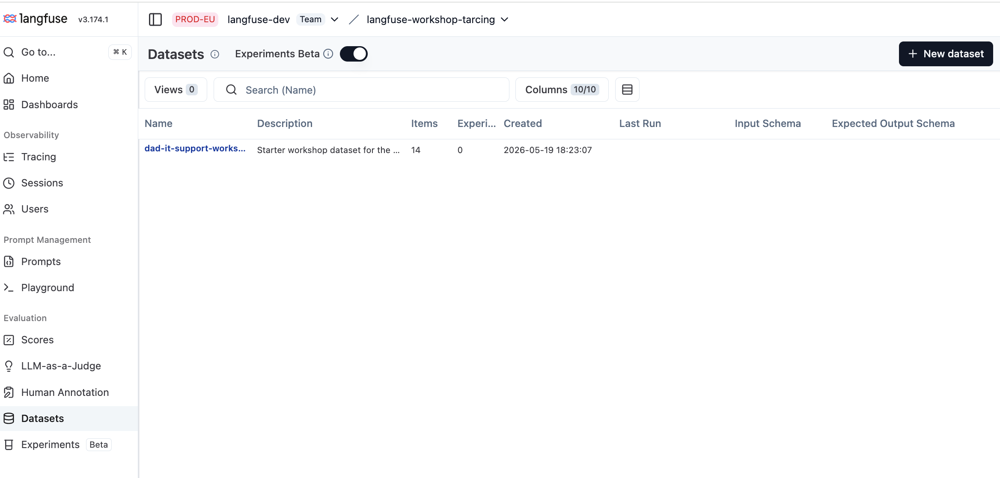
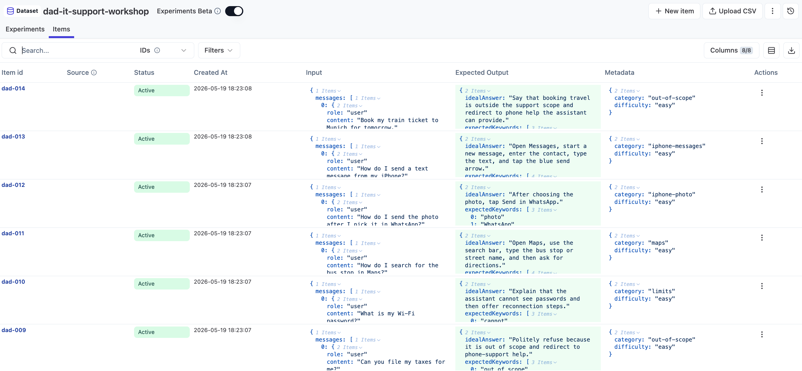

# 05 Dataset

## Why build datasets

A dataset is your representation of what the system will face in production — the inputs you expect, and for each, what a good answer looks like. With a clear set of expectations written down, you can rerun the agent against them after every change and know whether you helped or hurt. A good dataset is the foundation for shipping confidently and iterating without regressing.

Learn more in the [Langfuse Academy lesson on datasets](https://langfuse.com/academy/datasets).

## Goal

Seed a first hosted Langfuse dataset that captures the kinds of requests we expect Specs to handle. To get there:

1. **Understand the item shape** — every dataset item has the same three fields, and we want ours to match the agent's actual input.
2. **Seed the hosted dataset** so it lives in Langfuse and is ready for experiments in the next step.


## Starting point

```bash
git checkout checkpoint/04-monitoring
```

You have a traced, attributed, monitored app. `data/seed-dataset.json` (the iPhone-only 14-item starter set) and `scripts/seed-dataset.ts` are already in the repo — you read them and run the seed script.

Make sure `.env` has:

```bash
DATASET_NAME=dad-it-support-workshop
```

## Step 1 — Read the item shape

Dataset items in Langfuse follow a consistent shape — three fields, one required, two optional:

| Field | Required | Purpose |
| --- | --- | --- |
| `input` | yes | What you'd feed the agent. For us, the same `{ messages: [...] }` shape `/api/chat` accepts. |
| `expectedOutput` | optional | What a good answer would look like. Free-form — used by evaluators to compare actual vs expected. |
| `metadata` | optional | Tags or other fields for filtering and grouping (`category`, `difficulty`, etc.). |

One concrete item from our seed file:

```json
{
  "id": "dad-001",
  "input": {
    "messages": [{ "role": "user", "content": "How do I turn Bluetooth on on my iPhone?" }]
  },
  "expectedOutput": {
    "idealAnswer": "Open Settings, tap Bluetooth, and turn the Bluetooth switch on.",
    "expectedKeywords": ["Settings", "Bluetooth", "switch", "on"]
  },
  "metadata": { "category": "iphone-bluetooth", "difficulty": "easy" }
}
```

Two things to notice:

- **`input.messages`** matches `/api/chat`'s shape exactly so the experiment script in step 06 can call the same `runSupportConversation(...)` without rewriting inputs.
- **`expectedOutput`** has both an `idealAnswer` (for human review and LLM-as-a-judge correctness scoring) and `expectedKeywords` (for a quick deterministic check that the answer covered the right steps).

## Step 2 — Seed the hosted dataset

There are several ways to get items into a Langfuse dataset:

- **Add items manually** in the UI (Datasets → New item).
- **Upload a CSV / JSON** file via the UI.
- **Turn live production traces** into dataset items directly from the Trace view — this is the most powerful path once monitoring is catching interesting traces.
- **Programmatic seeding** via the SDK / CLI — best for an initial bulk load like ours.

For this workshop we use the programmatic path because we already have a curated JSON file:

```bash
npm run dataset:seed
```

Open Langfuse → **Datasets**. The list view should show the new `dad-it-support-workshop` dataset with 14 items and 0 experiment runs:



Click into the dataset and switch to the **Items** tab. Every seeded item shows up with input, expected output, and metadata columns:



If the dataset already exists, the script upserts.

## What the starter dataset covers

The seed deliberately covers each part of the iPhone scope plus the obvious edge cases:

- iPhone Bluetooth basics and "Bluetooth is on but device doesn't show up"
- iPhone Wi-Fi reconnect and "I can't see the network name"
- Photo capture + WhatsApp share, opening the latest photo, sending it
- Apple Maps directions (and the live-location limit)
- Messages basics
- Out-of-scope requests (file my taxes, book my train)
- Limitation cases (passwords, live location)

If you add items later, prefer ones that match a real signal you saw in monitoring rather than items invented from scratch.

## Teaching point

Datasets are how you write down what your system is expected to handle. A good one gives you confidence to ship and to iterate without regressing. You can seed datasets via the Langfuse CLI or [**Claude Code skill**](https://langfuse.com/docs) (`/langfuse`), build them from production traces in the UI, or maintain them in code like we did — the right approach depends on where your best examples come from.

Next, in `06-experiments`, this dataset becomes the input to runs against the real agent.
