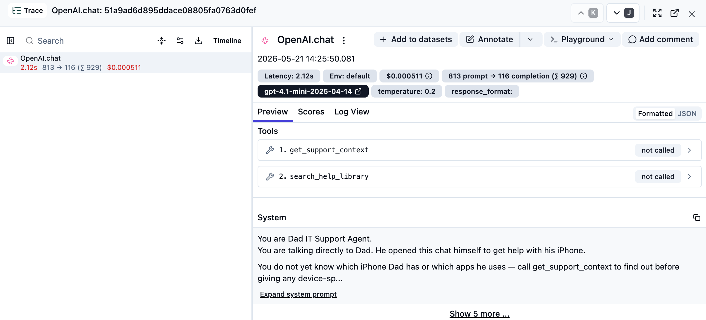
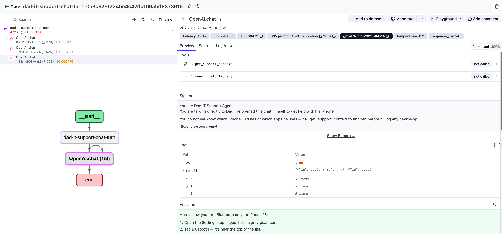
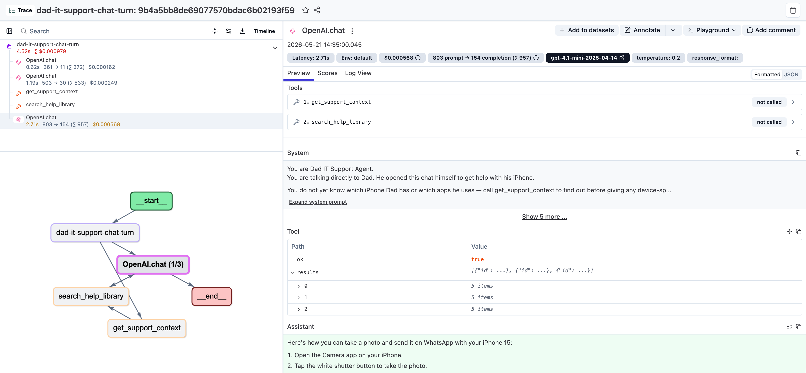

# 02 Tracing

## Starting point

```bash
git checkout checkpoint/02-tracing
```

This is the blank slate for the tracing step — same code as `checkpoint/01-base-app`, with no Langfuse wiring yet. The Langfuse packages are already in `package.json` — run `npm install` if you haven't. Make sure `.env` has your `OPENAI_API_KEY` and Langfuse keys.

## Why we trace

Tracing logs every step your agent takes — every model call, every tool invocation, the inputs that went in and the outputs that came back — in the order they happened. It turns the agent from a black box into something you can open up and inspect after the fact, so when an answer is wrong you can point at the exact step where it went wrong instead of guessing.

If you want the bigger-picture motivation, see the [Langfuse Academy lesson on tracing](https://langfuse.com/academy/tracing). If you want the technical details (SDK options, OpenTelemetry internals, span attributes), the [tracing docs](https://langfuse.com/docs/tracing) cover that.

## Goal

When Dad asks "How do I turn Bluetooth on?", the agent doesn't just hit OpenAI once. Behind the scenes it asks OpenAI what to do, calls `get_support_context` to fetch Dad's iPhone setup, asks OpenAI again, calls `search_help_library` for Bluetooth steps, then asks OpenAI one more time to produce the numbered answer. None of that is visible today.

The goal of this chapter is to make every one of those steps visible in Langfuse — one chat turn becomes one nested trace with the agent run, the OpenAI generations, and the two tool calls all logged in order.


We will build up the trace in three steps that mirror the agent's structure:

1. **First trace** — log the OpenAI generations themselves.
2. **Nested traces** — group the generations under one agent run per turn.
3. **Recording tool calls** — make each tool invocation its own observation.


## Step 1 — First trace

We want observability on the OpenAI calls themselves to see what the inputs and outputs are, and how much cost, tokens and time is spent. Two changes are enough.

### `src/server/index.ts`

Start the Langfuse span processor near the top of the file:

```ts
import { NodeSDK } from "@opentelemetry/sdk-node";
import { LangfuseSpanProcessor } from "@langfuse/otel";

new NodeSDK({ spanProcessors: [new LangfuseSpanProcessor()] }).start();
```

The processor reads `LANGFUSE_PUBLIC_KEY`, `LANGFUSE_SECRET_KEY`, and `LANGFUSE_BASE_URL` from the environment.

### `src/server/support-agent.ts`

Add the import:

```ts
import { observeOpenAI } from "@langfuse/openai";
```

Then **wrap the OpenAI client where you create it**. Find this line in `runSupportConversation`:

```ts
const openai = new OpenAI({ apiKey: env.openaiApiKey });
```

and change it to:

```ts
const openai = observeOpenAI(new OpenAI({ apiKey: env.openaiApiKey }));
```

That's the entire diff. No factory function, no separate raw client — `observeOpenAI` wraps the OpenAI client inline at the call site, and `openai.chat.completions.create(...)` below it now emits a trace for every call.


**Verify:** `npm run dev`, ask one question, refresh Langfuse — you should see one generation per OpenAI call with prompt, response, tokens, and latency. Each generation is still its own top-level trace; we fix that next.



## Step 2 — Nested traces

To put the generations into context we group them under one agent run per turn. Three edits in `src/server/support-agent.ts` — no function body changes.

**1. Add the import:**

```ts
import { observe } from "@langfuse/tracing";
```

**2. Demote the existing function.** Find:

```ts
export async function runSupportConversation(request: ChatRequest): Promise<ChatResponse> {
```

Drop the `export` and rename it:

```ts
async function runSupportConversationInner(request: ChatRequest): Promise<ChatResponse> {
```

The body stays exactly as it is.


**3. Add the wrapped export at the bottom of the file:**

```ts
export const runSupportConversation = observe(runSupportConversationInner, {
  name: "dad-it-support-chat-turn",
  asType: "agent"
});
```

`index.ts` still imports `runSupportConversation` the same way. `observe(...)` auto-captures the function argument as the trace input and the return value as the trace output.

**Verify:** one chat turn should now show up as a single `dad-it-support-chat-turn` observation with the OpenAI generation nested underneath.




## Step 3 — Recording tool calls

The OpenAI generation already mentions the tool calls in its `tool_calls` output, but we have no observation for the actual tool execution — no way to see what input went in and what came out. The same `observe(...)` pattern, can be applied to each tool.

### `src/server/tools.ts`

Add the import and the two observed helpers above `executeTool`, then redirect the switch at them. `TOOL_DEFINITIONS` stays untouched.

```ts
import { observe } from "@langfuse/tracing";

const getSupportContextTool = observe(
  async () => {
    const context = getSupportContext();

    return {
      ok: true,
      context: {
        id: context.id,
        label: context.label,
        devices: context.devices,
        deviceSummary: context.deviceSummary,
        responseStyle: context.responseStyle,
        scopeHighlights: context.scopeHighlights,
        notableApps: context.notableApps
      }
    };
  },
  { name: "get_support_context", asType: "tool" }
);

const searchHelpLibraryTool = observe(
  async (input: { question: string }) => {
    const guides = searchGuides(input.question);

    return {
      ok: true,
      results: guides.map((guide) => ({
        id: guide.id,
        title: guide.title,
        summary: guide.summary,
        steps: guide.steps,
        caution: guide.caution ?? null
      }))
    };
  },
  { name: "search_help_library", asType: "tool" }
);

export async function executeTool(name: string, input: Record<string, unknown>): Promise<ToolResult> {
  switch (name) {
    case "get_support_context":
      return getSupportContextTool();

    case "search_help_library":
      return searchHelpLibraryTool({ question: String(input.question ?? "") });

    default:
      return { ok: false, error: `Unsupported tool: ${name}` };
  }
}
```




## How to verify you are done

- A single user turn creates one trace in Langfuse.
- Root observation: `dad-it-support-chat-turn` (type `agent`).
- Child generation from `observeOpenAI(...)` with prompt, response, tokens, latency.
- Child tool observations: `get_support_context`, `search_help_library`.
- Root input is the chat request; root output is the chat response.

## Wrap-up

Same pattern, different observation types, same concept: `observe(fn, { asType })` wraps a function and emits a span with the name and type you give it. `observeOpenAI(client)` is a specialized version of that wrap for the OpenAI SDK.

A more straightforward way to add rich tracing in line with Langfuse best practices is the [**Langfuse skill**](https://github.com/langfuse/skills) (`/langfuse`). It applies the recommended patterns to your codebase without you hand-rolling each wrap. This walkthrough exists so you understand what the skill is doing under the hood.

`observeOpenAI` itself wraps the official OpenAI SDK — under the hood it's the same as the Langfuse [auto-instrumentation for OpenAI JS](https://langfuse.com/integrations/model-providers/openai-js). If you're using a different SDK (Anthropic, Vercel AI SDK, your own HTTP client), the Langfuse [integrations catalogue](https://langfuse.com/integrations) has the equivalent wrapper or auto-instrumentation guide.

## Appendix/Bonus section — User and session IDs

The walkthrough above gets you tracing with a clean parent → generation → tool shape. The next thing most teams want is to **slice traces by user and by session** — so you can pull up "every turn this user has had with the agent" or "the full multi-turn session from yesterday morning."
For simplicity reasons we skip this step in the live tracing walkthrough, but the checkpoints after tracing include it so later chapters can use session/user views without another code step. See information on [Sessions](https://langfuse.com/docs/observability/sessions) and [Users](https://langfuse.com/docs/observability/users) in the Langfuse docs.

In short:

```ts
import { propagateAttributes } from "@langfuse/tracing";

return propagateAttributes(
  {
    userId: request.userId ?? `workshop-${context.id}`,
    sessionId: request.sessionId,
    tags: ["langfuse-workshop", "dad-it-support"]
  },
  async () => {
    // ...the same tool-calling loop...
  }
);
```

Anything inside the `propagateAttributes(...)` block — including all child spans emitted by `observeOpenAI` — automatically gets the `userId`, `sessionId`, and tags attached. The Langfuse **Users** view, **Sessions** view, and tag filters all light up as soon as the attributes are present.


## End state

This finished traced app is the starting point for `03-prompt-management` and `04-monitoring`.
