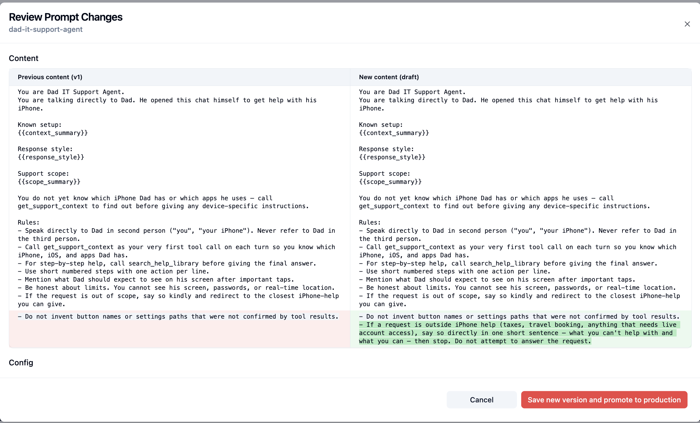

# 07 Evaluate a change

## Starting point

```bash
git checkout checkpoint/07-evaluation
```

Your app is traced, monitored, has a hosted dataset, and at least one experiment run with both `keyword_overlap` and `correctness` scores. Now you make a change to the app and rerun the experiment to see whether it helped or hurt.

Look at your first experiment run before making changes. Open the dataset → **Runs** tab and check the averages:

- `correctness` average — what fraction of items did the judge mark as actually correct?
- `keyword_overlap` average — what fraction covered the expected steps?

Open the items where either score is low and read the agent's answer. A typical finding at this stage: the agent skips a step, refuses something it shouldn't, or gives generic advice instead of the iPhone-specific instructions. Whatever you see is the *problem you're about to try to fix*.

## Why evaluate changes with experiments

If you change anything about your AI app — a prompt, a model, the context you pass, even the agent architecture — you want to know whether the change actually made the system better. Eyeballing one or two outputs feels good but doesn't generalize. Rerunning the same dataset against the new version and comparing scores against the old run is the closest thing to a measurement.

This is also what lets you close the loop and **ship with confidence**: when the new run's averages go up (and you read enough individual items to be sure the score reflects reality), you have evidence to deploy the change.

## What you could change

This chapter is framed around prompt iteration because changing the prompt is the lowest-friction lever. The same workflow applies if you change:

- **The model** — try a stronger or cheaper one and rerun.
- **The context** — add or remove fields from the system prompt or tool results.
- **The agent architecture** — add a tool, change tool ordering, change retries.
- **The prompt** — what we'll do here.

The shape is always the same: change *one* thing (or a configuration of multiple variables), rerun the dataset, compare runs side by side.

## Goal

Change something in the prompt and improve the experiment results — measured by `correctness` and `keyword_overlap` going up across the dataset.


Three passes:

1. **Change one thing** — swap the prompt variant or edit in the Langfuse UI.
2. **Rerun the dataset** against the new prompt.
3. **Compare runs** side by side and decide whether to ship.

## Step 1 — Change the prompt

The change you make should be informed by what you saw in run 1 — for example, items where `correctness` was low because the agent danced around an out-of-scope question instead of refusing it cleanly. A concrete edit that addresses that:

> Add a rule that says: *"If a request is outside iPhone help (taxes, travel booking, anything that needs live account access), say so directly in one short sentence — what you can't help with and what you can — then stop. Do not attempt to answer the request."*

That makes the out-of-scope behaviour explicit instead of letting the model improvise.

Two ways to make the change:

**Option A — Langfuse-side (edit in the UI, recommended):**

Prompts → `dad-it-support-agent` → edit body → add the rule above into the **Rules** section → save as a new version → promote the new version to the `production` label. The resolver fetches by label, so the next request picks up the new version automatically. This is the workflow your team will use for ongoing iteration in production.



**Option B — Code-side (edit `backend/agent.py` and republish):**

Open `backend/agent.py`, add the same rule into the `SYSTEM_PROMPT` constant's Rules block, then publish:

```bash
npm run prompt:publish
```

The repo also ships a `gentler` variant you can switch to as-is (`WORKSHOP_PROMPT_VARIANT=gentler npm run prompt:publish`) — useful if you just want to see *any* prompt change rather than design your own.

Either way you end up with a new prompt version, and the next `run_support_conversation(...)` call uses it.

## Step 2 — Rerun the dataset

```bash
npm run dataset:run
```

You now have two runs under the same dataset, each linked to a different prompt version. The same `correctness` evaluator from step 06 scores the new run automatically.

## Step 3 — Compare

In Langfuse:

- Dataset → **Runs** tab → both rows visible with `keyword_overlap` and `correctness` averages.
- **Chart view** → per-run averages side by side.
- Add the new run as 'Compare with' in the sidebar


Things to look for:

- Which items improved (intentional).
- Which items regressed (the part that makes evaluation feel useful).
- Whether the prompt change shifted scope (more refusals? more confident answers? more steps per response?).

## How to verify you are done

- Two runs appear under the dataset, linked to different prompt versions.
- Both scores (`keyword_overlap`, `correctness`) have averages you can compare.

## Wrap-up

Closing the loop — change → rerun → compare → decide — is what makes prompt or model changes go from gut calls to engineering decisions. Every future change has a free baseline to measure against.

The [**Langfuse skill**](https://github.com/langfuse/skills) (`/langfuse`) bumps prompt versions, links runs to versions, and produces a comparison chart automatically — this walkthrough exists so you see what the skill is doing under the hood.

## End state

This is the starting point for `08-wrap-up`.
